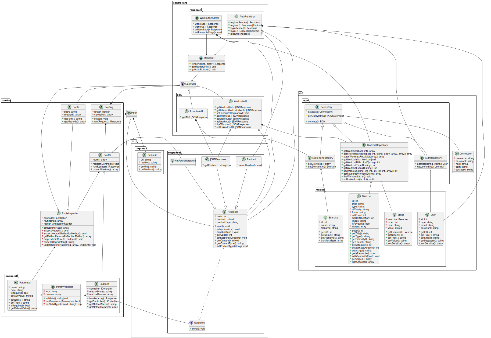

# HIITrainer

Web page for managing workouts and exercising.

Written in pure PHP with dynamic routing, following SOLID principles.
```php
/**
 * @Route(path="/workout/{id}", methods={"GET"})
 */
public function getWorkout(int $id): JSONResponse {
    ...
```

## UML



## Examples


